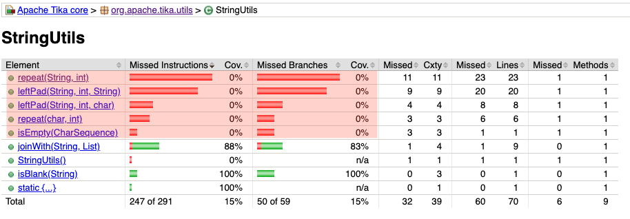
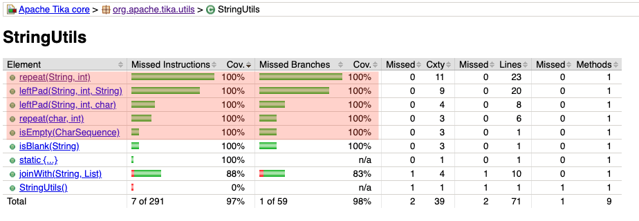
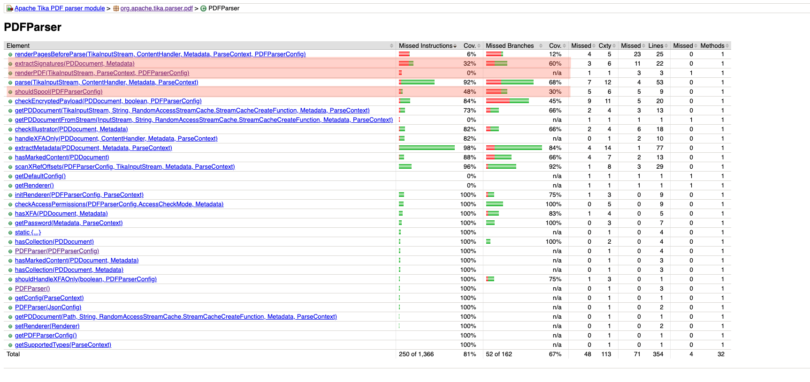
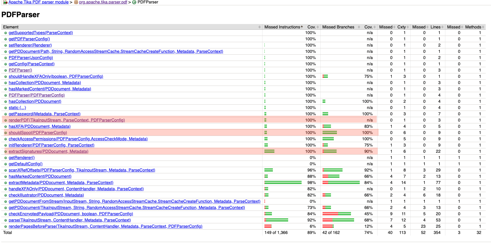

# Test Documentation

Tests cover six methods across two modules, generated via **ChatUniTest** and manually reviewed before integration.

---

## Module: `tika-core` — `StringUtils`

**File:** `tika-core/src/test/java/org/apache/tika/utils/StringUtilsTest.java`  
**Coverage:** 15% → 97% instructions / 15% → 98% branches (target methods: 0% → 100%)

### Code Coverage Comparison (JaCoCo)

| Baseline (Before) | Post-Generation (After) |
| :---: | :---: |
|  |  |

### `isEmpty(CharSequence cs)` — 5 tests

| Test | Scenario |
|:---|:---|
| `testIsEmptyWithNull` | `null` → `true` (null guard) |
| `testIsEmptyWithEmptyString` | `""` → `true` |
| `testIsEmptyWithNonEmptyString` | `"hello"` → `false` |
| `testIsEmptyWithWhitespaceString` | `" "` → `false` (distinguishes from `isBlank`) |
| `testIsEmptyWithStringBuilder` | Empty/non-empty `StringBuilder` — validates `CharSequence` polymorphism |

### `leftPad(String, int, String)` — 7 tests

One test per structural branch: null input, empty/null padStr (normalised to space), no padding needed (`pads <= 0`), single-char pad (delegates to char overload), exact fit (`pads == padLen`), partial pad (`pads < padLen`), cyclic fill (`pads > padLen`).

### `leftPad(String, int, char)` — 4 tests

Null input, no padding needed, normal path (`pads <= PAD_LIMIT`), overflow branch (`pads > PAD_LIMIT`, forced via `PAD_LIMIT = 5`).

### `repeat(char, int)` — 2 tests

Fast-exit (`repeat <= 0` → `EMPTY`), normal char-fill loop.

### `repeat(String, int)` — 6 tests

Null input, zero/negative repeat, identity fast-path (`repeat == 1` or `inputLength == 0`), single-char with both PAD_LIMIT sub-branches, `inputLength == 2` (switch `case 2`), `inputLength > 2` (switch `default`).

---

## Module: `tika-parser-pdf-module` — `PDFParser`

**Coverage:** 81% → 89% instructions / 67% → 74% branches across `PDFParser` (target methods: `renderPDF` 0% → 100%, `shouldSpool` 48.1% → 100%, `extractSignatures` 32.7% → 100% instructions / 60% → 90% branches)

### Code Coverage Comparison (JaCoCo)

#### Baseline Coverage (Before: 81%)

#### Post-Generation Coverage (After: 89%)

### `renderPDF(TikaInputStream, ParseContext, PDFParserConfig)` — 1 test

**File:** `…/PDFParser_renderPDF_10_0_Test.java` | **Coverage:** 0% → 100%

`testRenderPDF`: Mocked `Renderer` wired via `setRenderer()`; private method invoked via reflection. Establishes reachability and verifies a `RenderResults` object is returned.

### `extractSignatures(PDDocument, Metadata)` — 3 tests

**File:** `…/PDFParser_extractSignatures_7_0_Test.java` | **Coverage:** 32.7% → 100% instructions / 60% → 90% branches

| Test | Scenario | Assertions |
|:---|:---|:---|
| `testExtractSignaturesEmpty` | Empty field list | `HAS_SIGNATURE_FIELDS` and `HAS_SIGNATURE` absent |
| `testExtractSignaturesNullSignature` | One unsigned field | `HAS_SIGNATURE_FIELDS = "true"`, `HAS_SIGNATURE` absent |
| `testExtractSignaturesValid` | Fully signed field | All 7 metadata keys asserted; exercises the previously dead signed-field block |

`PDDocument`, `PDSignatureField`, and `PDSignature` are mocked; private method accessed via reflection.

### `shouldSpool(PDFParserConfig)` — 6 tests

**File:** `…/PDFParser_shouldSpool_8_0_Test.java` | **Coverage:** 48.1% → 100% instructions / 30% → 100% branches

| Test | Configuration | Expected |
|:---|:---|:---|
| `testImageStrategyRenderPagesBeforeParse` | `RENDER_PAGES_BEFORE_PARSE` | `true` |
| `testImageStrategyRenderPagesAtPageEnd` | `RENDER_PAGES_AT_PAGE_END` | `true` |
| `testExtractIncrementalUpdateInfoTrue` | `extractIncrementalUpdateInfo = true` | `true` |
| `testParseIncrementalUpdatesTrue` | `parseIncrementalUpdates = true` | `true` |
| `testOcrStrategyNoOcr` | All flags off, `Strategy = NO_OCR` | `false` |
| `testDefaultConfigShouldSpool` | All flags off, `Strategy = AUTO` | `true` |

Private method accessed via `getDeclaredMethod` + `setAccessible(true)`, wrapped in a shared `invokeShouldSpool()` helper.

---

## Analysis: Strengths & Weaknesses

### Oracle Strength Summary

| Test Class | Oracle Strength | Mutation Effectiveness |
|:---|:---|:---|
| `PDFParser_extractSignatures_7_0_Test` | **Strong** — exact field-by-field assertions | **High** — kills all 6 metadata-assignment mutants |
| `StringUtilsTest` | **Strong** — exact string equality | **High** — kills boundary mutants across all branches |
| `PDFParser_shouldSpool_8_0_Test` | **Moderate** — correct return-value assertions, no propagation | **Moderate** — kills branch mutants, not call-site mutants |
| `PDFParser_renderPDF_10_0_Test` | **Weak** — `assertNotNull` only | **Low** — kills only null-return mutants |

### Per-Class Notes

**`StringUtilsTest` ✅** PAD_LIMIT temporarily lowered to 5 to force overflow branches without 10 000-char strings. All assertions use exact Javadoc-derived values.  
⚠️ `repeat(char, int)` under-tested; `switch-case 1` in `repeat(String, int)` is structurally unreachable dead code in `StringUtils` itself; `isBlank`/`joinWith` remain at 0%.

**`PDFParser_extractSignatures_7_0_Test` ✅** Three tests cleanly partition the branch space; strong oracle kills all living mutants.  
⚠️ `SIGNATURE_DATE` only asserted with `assertNotNull` (format not validated); no multi-field loop test.

**`PDFParser_shouldSpool_8_0_Test` ✅** All four previously unreached branches covered; negative case (`false`) prevents always-true mutant survival.  
⚠️ Propagation not validated: whether `PDFParser.parse()` actually spools when `shouldSpool` returns `true` is untested (RIP propagation gap).

**`PDFParser_renderPDF_10_0_Test` ✅** Correct reflection pattern; crosses 0% coverage threshold.  
⚠️ `assertNotNull(results)` is vacuous — `mockResults` is non-null by definition. Fix: use `assertSame` + `verify(mockRenderer).render(...)`.

### Cross-Cutting: ChatUniTest Capabilities

| Capability | Assessment |
|:---|:---|
| Structural branch coverage | **Good** — reliably finds and tests every conditional path |
| Mocking infrastructure | **Good** — correctly identifies heavyweight collaborators |
| Reflection for private methods | **Good** — generates correct `getDeclaredMethod` / `setAccessible` patterns |
| Boundary value engineering | **Good** — non-trivial insight into package-private state |
| Propagation oracles | **Poor** — asserts direct return values, never downstream effects |
| Loop body / multi-iteration testing | **Poor** — single-element scenarios only |
| Exception / error paths | **Poor** — no generated test exercises throws or invalid inputs |
| Deep semantic oracles | **Poor** — defaults to `assertNotNull` when exact value cannot be inferred |

---

## ChatUniTest Limitations

ChatUniTest generates tests in isolation from repository build standards, requiring systematic manual post-processing before integration into Apache Tika:

- **Wildcard imports:** Consistently injects star imports (e.g., `import static org.junit.jupiter.api.Assertions.*`), failing Checkstyle's `AvoidStarImportCheck`.
- **Missing dependencies:** Generates Mockito-based tests without verifying `mockito-core` is declared in the submodule POM.
- **Orphan binaries:** Aborted generation candidates leave `.class` files in `target/test-classes/`, causing spurious Surefire failures.
- **Fragile assertions:** Defaults to `assertNotNull` or hallucinates incorrect expected values (e.g., wrong PDF version strings).

To address these recurring issues, the `.agents/skills/chatunitest-generator/SKILL.md` runbook was established early, codifying the mandatory post-processing steps (import cleanup, orphan deletion, SPI regeneration, Checkstyle validation).
